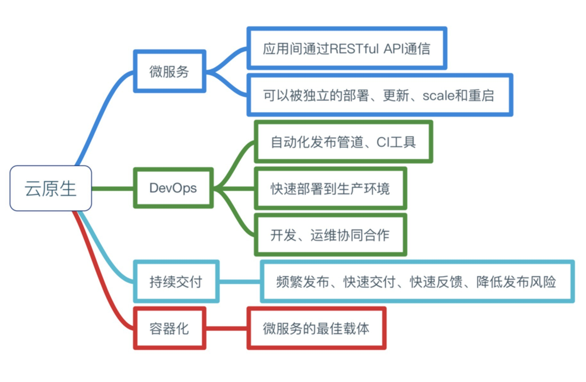

# Developing Architecture

## 目錄

1. [前言](developing_architecture.md#preface)
2. [概述](developing_architecture.md#ch1)
3. [目的](developing_architecture.md#ch2)
4. [學習目標](developing_architecture.md#ch3)
5. [前端](developing_architecture.md#ch4)  

    5.1. [Angular](developing_architecture.md#ch4-1)  

    5.2. [Vue](developing_architecture.md#ch4-2)

6. [服務](developing_architecture.md#ch5)  

    6-1. [Spring Boot](developing_architecture.md#ch5-1)  

    6-2. [Spring Cloud](developing_architecture.md#ch5-2)  

    6-3. [Spring to Docker](developing_architecture.md#ch5-3)  

7. [測試](developing_architecture.md#ch6)  

    7-1. [單元測試](developing_architecture.md#ch6-1)  

    7-2. [自動化測試](developing_architecture.md#ch6-2)  

    7-3. [威脅偵測](developing_architecture.md#ch6-3)

8. [容器](developing_architecture.md#ch7)  

    8-1. [Images](developing_architecture.md#ch7-1)  

    8-2. [Dockerfile](developing_architecture.md#ch7-2)  

    8-3. [Volumes](developing_architecture.md#ch7-3)  

    8-4. [Network](developing_architecture.md#ch7-4)  

    8-5. [Docker compose](developing_architecture.md#ch7-5)

9. [容器管理平台](developing_architecture.md#ch8)  

    9-1. [Kubernetes](developing_architecture.md#ch8-1)  

    9-2. [Openshift](developing_architecture.md#ch8-2)  

    9-3. [Docker swarm](developing_architecture.md#ch8-2)

10. [DevOps](developing_architecture.md#ch9)
11. [總結](developing_architecture.md#conclusion)
12. [參考](developing_architecture.md#ch99)

## 前言

#### 思考軟體架構的變化時，有幾個名詞充斥在各種文章，在各大品牌的產品中出現，有的成為業界標準，有的亦成為加速軟體發展中所需具備的基礎知識。

#### 探討以前的軟體架構，遭遇到什麼困難，面臨到什麼排戰，迫使我們追求新的軟體架構。

#### 我們需要一個以更宏觀的角度，結合開發、維運、治理、分析，並且朝自動化、連結任何事的新的軟體架構。

[TOP](developing_architecture.md#top)

## 概述

### 為了讓同仁都具備一致的基礎知識，並且知道未來延伸的方向。

### 必須先具備的能力：

* **Java 開發能力**
* **Spring 使用經驗**
* **Restful API 測試及使用經驗**
* **資料庫使用經驗 MSSQL、H2Database**
* **Linux 基本指令**
* **Github 帳號**

**基礎知識：**

* **Modern web applications：具有比以往更高的使用者期望和更高的需求。現今的 Web 應用程式應該要在世界上的任何地方全天候可用，並可讓幾乎所有裝置或所有尺寸的螢幕使用。 Web 應用程式必須安全、靈活、可調整，以符合尖峰需求。 越來越複雜的案例應透過使用 JavaScript 建置在用戶端上豐富的使用者體驗來處理，並有效率地透過 Web API 進行通訊。**
* **Spring base application：以 Java 為基礎，提供廣泛的程式功能與設定模型，讓開發者更專注於應用程式的商業邏輯上，讓開發者不用重新打造輪子。**
* **Cloud Native：雲原生的軟體架構是基於微服務架構思維，以容器技術為載體，一種產品研發運營的全新模式。**
* **Micro Services：是獨立的可自治系統，以 API 提供服務或是取得服務，基本上依據業務功能切分微服服的顆粒度大小。**
* **Container：容器是一個標準的軟體單元，它將程式碼及其所有依賴關係打包\(系統工具，系統庫和設置\)，以便應用程式從一個運行環境快速可靠地運行到另一個運行環境。**
* **Continuous Integration / Continuous Delivery：**
* **DevOps EcoSystem：**
* **Agile Software Development：**

[CATALOG](developing_architecture.md#catalog) \| [NEXT](developing_architecture.md#ch2)

## 目的

#### 至少讓同仁都看得懂下圖，且知道現在待的案子達成了那些，及那些還可以加強的。

[PRIVOUS](developing_architecture.md#ch1) \| [CATALOG](developing_architecture.md#catalog) \| [NEXT](developing_architecture.md#ch3)

## 學習目標

架構

### 前端以現代化的網站應用程式開發，後台服務以 Spring Boot 應用程式為骨幹，互相以RESTful API 溝通，以容器技術建置環境，最終可以真的落實在專案開發上，打造自動化的軟體開發生命週期，以加速開發、整合、測試以及交付為目標。

## 前端

## Angular

## ~~Vue~~

## 服務

### Backend Service

## Spring Boot

## Spring Cloud

## Spring to Docker

## 測試

## 單元測試

## 自動化測試

## 威脅偵測

## 容器

## Images

## Dockerfile

## Volumes

## Network

## Docker compose

## 容器管理平台

## Kubernetes

## Openshift

## ~~Docker swarm~~

## DevOps

## 總結

## 參考

* [Sprig Boot docs](https://docs.spring.io/spring-boot/docs/1.5.20.BUILD-SNAPSHOT/reference/htmlsingle/)
* [Sprig Cloud docs](https://cloud.spring.io/spring-cloud-static/Edgware.SR5/single/spring-cloud.html)
* [Docker docs](https://docs.docker.com)
* [Modern Java Framework](https://spring.io)
* [Cloud Native Picture](https://github.com/shawnyhw6n9/Developing-Architecture/tree/742a5b7a42658a1fe957f1aafe8926b66d3507fe/resource/images/messageImage_1523528832290.jpg)
* [Cloud Native Technology Picture](https://github.com/shawnyhw6n9/Developing-Architecture/tree/742a5b7a42658a1fe957f1aafe8926b66d3507fe/resource/images/微服務技術棧.jpg)

[CATALOG](developing_architecture.md#catalog)

